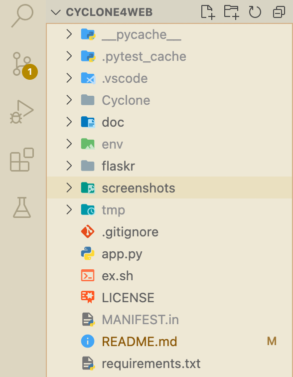
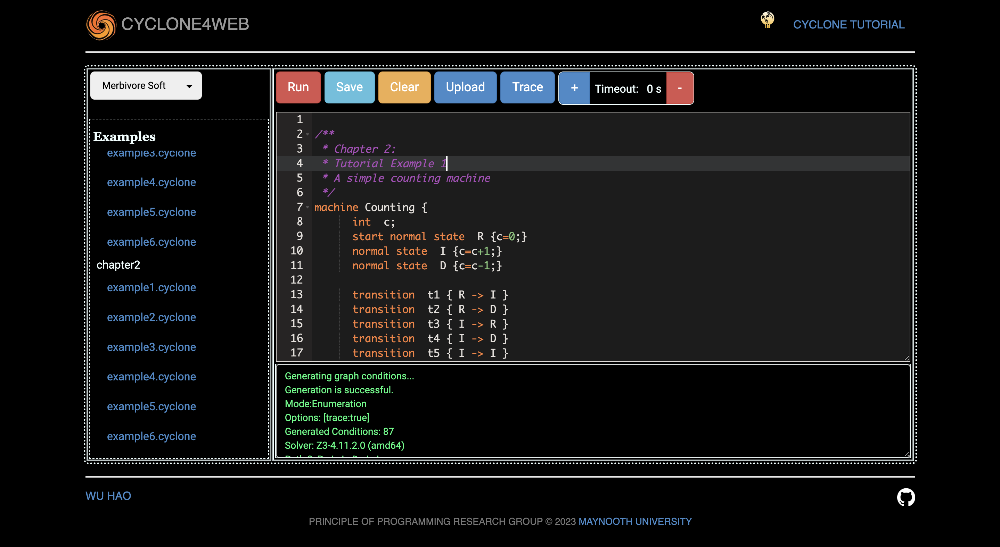
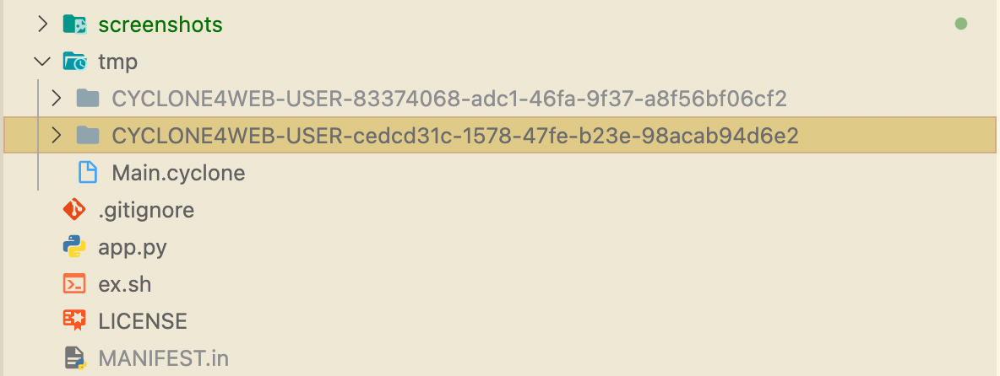
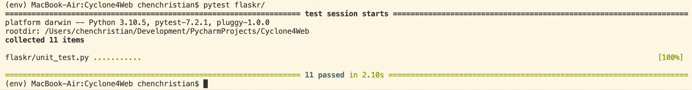

# Cyclone4Web

## 1. Goals of this project
This project is my final homework of <em><strong>CS642[A] — Msc Computer Science (Applied) Project </strong></em>. 

The whole project adopts **[Flask](https://flask.palletsprojects.com/en/2.2.x/)** framework, this is a micro web framework written in Python and depends on the `Jinja` template engine and the `Werkzeug WSGI` toolkit, to constructing a simple online integrated development environment for **[Cyclone](https://classicwuhao.github.io/cyclone_tutorial/tutorial-content.html)**. Cyclone is designed to provide a general solution to problems that can be described as a graph. Cyclone provides a specification language that allows users to describe a graphical structure along with conditions to be met and automatically solves them for you.

## 2. Before running
We need to install some softwares and tools to support the project.
* [Install Python 3.10.5](https://www.python.org/downloads/release/python-3105/) in your machine first.
* Clone `Cyclone4Web` to your machine.
* (Optional) Open CMD/Terminal and install the `virtualenv` by using the following command (this is a type of library that allows us to create a virtual environment and use it):
    ```
    > pip install virtualenv
    ```
* (Optional) Enter the project folder running the following command to create a virtual environment:
    ```
    > Python3 -m venv env  
    ```
* Install all the relavant [dependencies](requirements.txt) by using the following command: 
    ```
    (env) > pip install -r requirements.txt
    ```
* Make sure you have java (64 bit is recommended) installed on your machine.
* [Download Cyclone](https://classicwuhao.github.io/cyclone_tutorial/installation.html) and Unzip it to a folder called `Cyclone`.
* Copy the entire `Cyclone` folder to the root of the project

This is the well-configured project structure.
<div></div>

## 3. Run project
Open CMD/Terminal and execute the following command:
```
(env) > python3 app.py
    * Serving Flask app 'flaskr'
    * Debug mode: on
    * Running on http://127.0.0.1:8080 (Press CTRL+C to quit)
    * Restarting with stat
    * Debugger is active!
    * Debugger PIN: nnn-nnn-nnn
```
And then, you can visit the project by clicking the [local link](http://127.0.0.1:8080).

This is the screenshot of `HomePage`:
<div>

</div>

## 4. Project layout
As to project layout you can visit [Project Layout in Flask](https://flask.palletsprojects.com/en/2.2.x/tutorial/layout/)

This project layout will look like this:
```
./Cyclone4Web
├── flaskr/
│   ├── __init__.py
│   ├── config.py
│   ├── unit_test.sql
│   ├── src/
│   │   ├── __init__.py
│   │   └── editor_view.py
│   ├── templates/
│   │   ├── about.html
│   │   ├── error.html
│   │   ├── index.html
│   │   └── _layouts/
│   │       ├── default.html
│   │       ├── footer.html
│   │       ├── head.html
│   │       ├── header.html
│   │       └── script.html
│   └── static/
│       ├── js/
│       ├── css/
│       └── img/
├── Cyclone/
├── venv/
├── doc/
├── tmp/
├── ex.sh
├── app.py
├── MANIFEST.in
├── LICENSE
└── .gitignore

```

### **Foloders description:**
> <p><strong>./Cyclone4Web/flaskr</strong>, a Python package containing the application code and files.</p>
> <p><strong>./Cyclone4Web/venv</strong>, a Python virtual environment where Flask and other dependencies are installed.</p>
> <p><strong>./Cyclone4Web/doc</strong>, a folder for documents.</p>
> <p><strong>./Cyclone4Web/tmp</strong>, a foler used for storing temtorary data when server running.</p>
> <p><strong>./Cyclone4Web/Cyclone</strong>, an unziped Cyclone folder containing a runtime environment of Cyclone.</p>

> <p><strong>./Cyclone4Web/flaskr/src</strong>, a Python source code folder containing the critical code of interfaces.</p>
> <p><strong>./Cyclone4Web/flaskr/static</strong>, a folder containing the general static resources including .js, .css, and images.</p>
> <p><strong>./Cyclone4Web/flaskr/templates</strong>, a folder containing all the .html pages.</p>
> <p><strong>./Cyclone4Web/flaskr/templates/_layouts</strong>, a folder containing common .html templates that are abstracted using <strong>Jinja</strong>.</p>

### **Files description**:
> <p><strong>./Cyclone4Web/app.py</strong>, an entrance of the project.</p>
> <p><strong>./Cyclone4Web/ex.sh</strong>, a Shell script used for executing the .cyclone file in command-line.</p>

> <p><strong>./Cyclone4Web/flaskr/__init__.py</strong>, a crucial Python file where reads the configuration and defines the interfaces of the homepage entrance and error handlers when project starting.</p>
> <p><strong>./Cyclone4Web/flaskr/config.py</strong>, a Python file containing two classes namely <b>Config</b> and <b>Constants</b>. The first is used for the configuration of Flask and the other is used for maintaining constants.</p>
> <p><strong>./Cyclone4Web/flaskr/unit_test.sql</strong>, a test Python file including unit tests for all interfaces</p>

> <p><strong>./Cyclone4Web/flaskr/src/editor_view.py</strong>, the main Python file including all the definitions of critical interfaces.</p>
> <p><strong>./Cyclone4Web/flaskr/static/js/editor.js</strong>, the main Javascript file including all the logic that is responsible for dealing with the interfaces.</p>

## 5. Functions
1. HomePage(`http://localhost/editor`)
    - [x] authorization (user isolation)
    - [x] integrate an online code editor
        - syntax highlight
        - simple code complementation
        - the flexible size
        - various themes
        - shortcuts(Run -> Crtl + R | Update -> Crtl + U)
    - [x] integrate an output console
        - the flexible size
        - read only
    - [x] complie the online code and run it
    - [x] save the online code as a local file
    - [x] clear the code in the online code editor
    - [x] upload a `.cyclone` file to the online code editor(Maximum 10KB)
    - [x] a switch of `option-trace`
    - [x] a switch of `option-timeout`
    - [x] a loading covering when doing request
    - [x] support to extract and download the `.trace` file after runing
    - [x] list the examples in the `Cyclone` folder
    - [x] put the example code onto the online code editor when clicking
    - [x] a link to the official website of the **[Cyclone Tutorial](https://classicwuhao.github.io/cyclone_tutorial/tutorial-content.html)**
    - [x] a link to the **[Cyclone author](https://github.com/classicwuhao)**
2. AboutPage(`http://localhost/about`)
3. ErrorPage(`http://localhost/error`)
    - 404 Error handler
    - 405 Error handler

## 6. Unit Test
[Unit tests](./flaskr/unit_test.py) basically contain correctness tests for all interfaces. 

1. You need to modify a little code in [editor_view.py](./flaskr/src/editor_view.py) before running the unit tests:
    ```python
    ...
    def _get_user_id():
        # Production
        # return request.cookies.get(const.FIELD_USER_ID)
        # Test (We pass parameters instead of using the cookie)
        return request.form.get(const.FIELD_USER_ID)
    ...
    ```

2. The unique id will be automatically produced when a user open the web browser to visit `Cyclone4Web`. It is actually a name of one of the folders under the `tmp` folder`
    <div></div>

3. And then assign an avaiable unique id to `user_id` in [Unit tests](./flaskr/unit_test.py):
    ```python
    ...
    user_id = "use your an avaiable unique id to replace"
    ...
    ```

4. Finally, running the following command to verify:
    ```
    (env) > pytest flaskr/ 
    ```

This is the result in my machine:
<div></div>


## 7. Third-party frameworks in Cyclone4Web
<table>
    <thead>
        <tr>
            <th>Name</th>
            <th>Version</th>
            <th>Link</th>
            <th>Description</th>
        </tr>
    </thead>
    <tbody>
        <tr>
            <td>Notify.js</td>
            <td>0.4.2</td>
            <td><a href="https://notifyjs.jpillora.com/" target="_blank">https://notifyjs.jpillora.com</a></td>
            <td>Notify.js is a jQuery plugin to provide simple yet fully customisable notifications. </td>
        </tr>
        <tr>
            <td>jquery-loading</td>
            <td>2.0.0-rc.2</td>
            <td><a href="http://carlosbonetti.github.io/jquery-loading/" target="_blank">https://carlosbonetti.github.io/jquery-loading</a></td>
            <td>jquery-loading can add and manipulate loading states of any element on the page.</td>
        </tr>
        <tr>
            <td>Ace</td>
            <td>1.1.5</td>
            <td><a href="https://ace.c9.io/" target="_blank">https://ace.c9.io</a></td>
            <td>Ace is an embeddable code editor written in JavaScript.</td>
        </tr>
        <tr>
            <td>Bootstrap</td>
            <td>2.3.2</td>
            <td><a href="https://getbootstrap.com/2.3.2/" target="_blank">https://getbootstrap.com/2.3.2</a></td>
            <td>Bootstrap is a free and open-source CSS framework directed at responsive, mobile-first front-end web development.</td>
        </tr>
        <tr>
            <td>Flask</td>
            <td>2.2.2</td>
            <td><a href="https://flask.palletsprojects.com/en/2.2.x/" target="_blank">https://flask.palletsprojects.com/en/2.2.x</a></td>
            <td>Flask is a micro web framework written in Python and depends on the Jinja template engine and the Werkzeug WSGI toolkit.</td>
        </tr>
        <tr>
            <td>Jinja2</td>
            <td>3.1.2</td>
            <td><a href="https://jinja.palletsprojects.com/en/3.1.x/" target="_blank">https://jinja.palletsprojects.com/en/3.1.x</a></td>
            <td>Jinja is a fast, expressive, extensible templating engine. Special placeholders in the template allow writing code similar to Python syntax. Then the template is passed data to render the final document.</td>
        </tr>
        <tr>
            <td>pytest</td>
            <td>7.2.1</td>
            <td><a href="https://docs.pytest.org/en/7.2.x/" target="_blank">https://docs.pytest.org/en/7.2.x</a></td>
            <td>The pytest framework makes it easy to write small, readable tests, and can scale to support complex functional testing for applications and libraries.</td>
        </tr>
   </tbody>
</table>


## LICENSE
[Apache License Version 2.0](License) © [freestyletime](https://github.com/freestyletime)